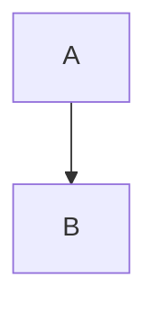

# Obsidian Slides Plugin — Implementation Plan

## Overview

A Slidev-inspired an opiniated presentation plugin for Obsidian with hybrid authoring (Markdown + live visual preview), core Google Slides features, and native support for Excalidraw, Mermaid, and LaTeX.

**Plugin name:** `obsidian-slides-plus`

---

## Architecture

### Slide Format

Standard `.md` files with `slides` frontmatter flag and `---` separators. Each slide can have per-slide frontmatter. This keeps files plain Obsidian notes — no custom file extension needed.

```markdown
---
slides: true
theme: default
transition: slide
aspectRatio: 16/9
---

# Welcome

Subtitle text

<!-- This is a speaker note -->

---
layout: two-cols
---

## Left Side

Content

::right::

## Right Side

Content

---

$$E = mc^2$$



![[drawing.excalidraw]]
```

### Project Structure

```
src/
├── main.ts                        # Plugin entry, registers everything
├── settings.ts                    # Settings tab + defaults
├── types.ts                       # Shared type definitions
│
├── parser/
│   ├── slideParser.ts             # Split markdown → Slide[] by --- separators
│   └── frontmatterParser.ts       # Per-slide frontmatter extraction
│
├── engine/
│   ├── renderEngine.ts            # Renders Slide → DOM using MarkdownRenderer.render()
│   ├── layoutEngine.ts            # Maps layout names → CSS grid templates
│   ├── transitionEngine.ts        # CSS transition orchestration between slides
│   └── themeEngine.ts             # Theme loading and switching
│
├── views/
│   ├── previewPanel.ts            # Side panel: live slide preview (ItemView)
│   ├── presentationView.ts        # Fullscreen presentation mode (ItemView, new window)
│   ├── presenterView.ts           # Speaker view: current slide + next + notes + timer
│   └── slideNavigator.ts          # Thumbnail grid for slide reordering
│
├── editor/
│   ├── slideDecorations.ts        # CM6: visual separator between slides in editor
│   └── commands.ts                # Commands: next/prev slide, present, export
│
├── integrations/
│   ├── excalidrawEmbed.ts         # Render ![[*.excalidraw]] as SVG in slides
│   ├── mermaidRenderer.ts         # Ensure mermaid blocks render in custom views
│   └── latexRenderer.ts           # Ensure math renders in custom views
│
├── export/
│   └── pdfExporter.ts             # Print-to-PDF via browser print API
│
└── themes/
    ├── default.css
    ├── dark.css
    └── minimal.css
```

### Key Architectural Decisions

| Decision | Choice | Rationale |
|----------|--------|-----------|
| Rendering engine | Direct DOM + `MarkdownRenderer.render()` | No iframe. Native access to Obsidian's Mermaid, MathJax, embeds, links. |
| Slide transitions | CSS transitions/animations | Lightweight, no framework dependency. |
| Layout system | Per-slide frontmatter → CSS grid templates | Inspired by Slidev's layout system. Extensible. |
| File format | Standard `.md` with frontmatter flag | No custom extensions. Works with Obsidian's editor, search, graph. |
| Excalidraw | Render `.excalidraw` JSON → SVG | Use `MarkdownRenderer.render()` which triggers Excalidraw's post-processor, or fallback to SVG export. |
| Math/Mermaid | Obsidian's built-in pipeline | `MarkdownRenderer.render()` handles both. Manual fallback via `loadMathJax()`/`renderMath()` if needed. |
| Preview panel | `ItemView` in right leaf | Updates on editor change via `workspace.on('editor-change')`. |
| Presentation mode | `ItemView` opened in new window | Full viewport, keyboard navigation, escape to exit. |
| PDF export | `window.print()` with `@media print` CSS | Simple, reliable. Uses browser's built-in PDF generation. |

---

## Implementation Phases

### Phase 1: Foundation (Core Plugin Scaffold)
**Goal:** Working plugin that parses slides and renders a basic preview.

1. **Scaffold the plugin** — `manifest.json`, `package.json`, `tsconfig.json`, `esbuild.config.mjs`, `main.ts`
2. **Slide parser** — Split markdown by `---`, extract global + per-slide frontmatter, handle speaker notes (`<!-- ... -->`)
3. **Render engine** — Take a `Slide` object, render its markdown content into a `<div>` using `MarkdownRenderer.render()`
4. **Preview panel** — `ItemView` in right sidebar showing the current slide. Updates when cursor moves between slides in the editor.
5. **Basic styling** — Slide container with 16:9 aspect ratio, centered content, base typography

### Phase 2: Presentation Mode
**Goal:** Fullscreen presenting with keyboard navigation.

6. **Presentation view** — Full-viewport `ItemView`. Renders one slide at a time. Keyboard: arrow keys, space, escape.
7. **Slide transitions** — CSS transitions: `slide`, `fade`, `none`. Configurable per-slide or globally via frontmatter.
8. **Speaker notes** — Parse `<!-- notes -->` blocks. Display in presenter view.
9. **Presenter view** — Second window/panel: current slide, next slide preview, speaker notes, elapsed timer, slide counter.

### Phase 3: Layouts & Themes
**Goal:** Slidev-style layouts and multiple visual themes.

10. **Layout engine** — Built-in layouts: `default`, `cover`, `center`, `two-cols`, `image-right`, `image-left`, `section`, `quote`. Each maps to a CSS grid/flexbox template.
11. **Slot syntax** — `::right::`, `::left::`, `::bottom::` content separators within a slide (Slidev-style).
12. **Theme engine** — Load theme CSS. Built-in themes: `default`, `dark`, `minimal`. Theme selected via frontmatter `theme:` property.
13. **Custom themes** — Users can create `.css` files in their vault's `.obsidian/plugins/obsidian-slides-plus/themes/` directory.

### Phase 4: Integrations (Excalidraw, Mermaid, LaTeX)
**Goal:** All three render correctly inside slides.

14. **LaTeX** — Should work via `MarkdownRenderer.render()`. Add fallback: explicit `loadMathJax()` + `renderMath()` calls if needed in presentation view.
15. **Mermaid** — Should work via `MarkdownRenderer.render()`. Add fallback: import mermaid.js and call `mermaid.render()` directly if needed.
16. **Excalidraw** — Handle `![[file.excalidraw]]` embeds. Use `MarkdownRenderer.render()` which triggers Excalidraw plugin's post-processor. Fallback: read `.excalidraw.md` file, extract SVG data, render directly.

### Phase 5: Editor Enhancements (Hybrid Authoring)
**Goal:** Enhanced editing experience with visual cues and drag support.

17. **Slide separator decorations** — CM6 ViewPlugin: replace `---` separators with visual slide dividers showing slide number and layout name.
18. **Slide commands** — Command palette: "Next Slide", "Previous Slide", "Insert Slide", "Present from Current Slide", "Open Preview Panel".
19. **Drag-to-position** — In preview panel: click an element, drag to reposition. Stores position as inline style or frontmatter metadata. Elements with custom positions use `position: absolute` within the slide container.

### Phase 6: Export & Polish
**Goal:** PDF export and production-quality UX.

20. **PDF export** — Render all slides into a hidden container, apply `@media print` styles, trigger `window.print()`. Each slide = one page.
21. **Slide navigator** — Thumbnail grid view (accessible via command). Click to jump to slide. Drag to reorder (updates markdown).
22. **Settings tab** — Default theme, default transition, aspect ratio, font size, presenter view preferences.
23. **Images & backgrounds** — Per-slide `background:` frontmatter (color, gradient, or image URL). Image sizing/positioning within slides.

---

## Layouts Reference (Slidev-inspired)

| Layout | Description | Slot syntax |
|--------|-------------|-------------|
| `default` | Title + content, top-aligned | (none) |
| `cover` | Centered, large text, for title slides | (none) |
| `center` | All content vertically + horizontally centered | (none) |
| `two-cols` | Two equal columns | `::right::` separates left/right |
| `image-right` | Content left, image right | `image:` in frontmatter |
| `image-left` | Image left, content right | `image:` in frontmatter |
| `section` | Large centered heading, for section dividers | (none) |
| `quote` | Styled blockquote layout | (none) |
| `full` | No padding, content fills entire slide | (none) |

---

## Tech Stack

- **Language:** TypeScript
- **Build:** esbuild (standard Obsidian plugin toolchain)
- **Rendering:** Obsidian's `MarkdownRenderer.render()` + custom CSS
- **Editor extensions:** CodeMirror 6 (via Obsidian's CM6 API)
- **Math:** Obsidian's built-in MathJax (`loadMathJax`, `renderMath`)
- **Mermaid:** Obsidian's built-in Mermaid support
- **Excalidraw:** Obsidian's embed pipeline + Excalidraw plugin's post-processor
- **PDF:** Browser print API with `@media print` CSS
- **No external frameworks** — No React, Vue, or heavy dependencies

---

## Risks & Mitigations

| Risk | Mitigation |
|------|------------|
| `MarkdownRenderer.render()` might not trigger Excalidraw/Mermaid post-processors in custom views | Fallback: render manually using mermaid.js / SVG extraction / `renderMath()` |
| Drag-to-position complexity | Start simple: percentage-based absolute positioning. No rotation/resize in v1. |
| CSS transitions may jank on complex slides | Keep slide DOM simple. Use `will-change` and `transform` for GPU-accelerated transitions. |
| PDF export quality | `@media print` approach is well-tested. Alternative: use `html2canvas` + `jsPDF` if needed. |
| Theme CSS conflicts with Obsidian's styles | Scope all slide styles under `.slides-plus-container` class. |

---

## What's NOT in Scope (v1)

- Real-time collaboration
- Element-level animations (appear/fade individual items)
- PPTX export
- Custom drawing tools (rely on Excalidraw plugin)
- Video/audio embedding
- Slide master/template inheritance
- Remote presentation control
