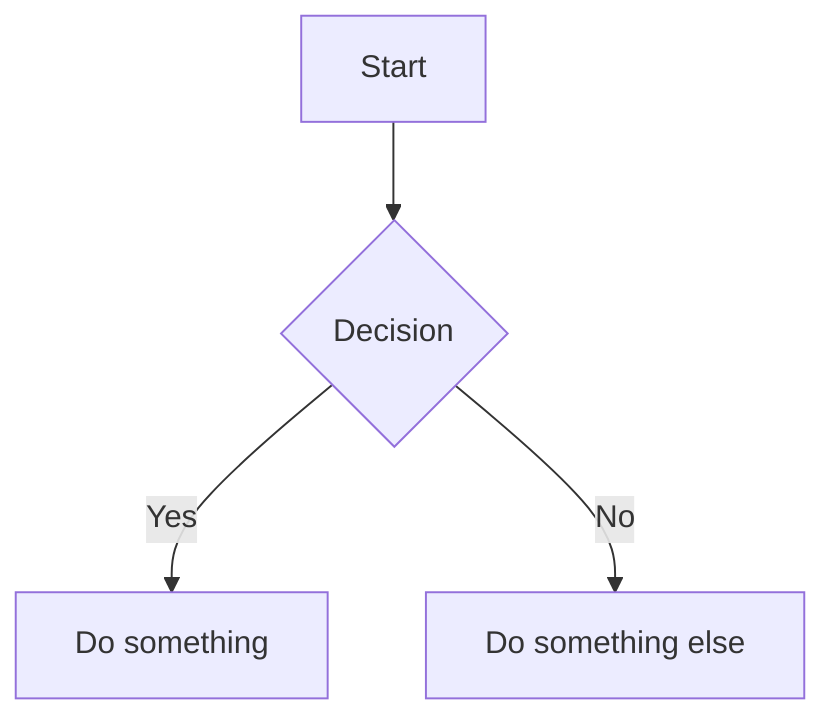

# Slides Plus — User Guide

## Installation

1. Build the plugin (if not already built):
   ```bash
   npm install
   npm run build
   ```

2. Copy these three files to your Obsidian vault:
   ```
   .obsidian/plugins/obsidian-slides-plus/
   ├── main.js
   ├── manifest.json
   └── styles.css
   ```

3. Open Obsidian → Settings → Community plugins → Enable **Slides Plus**

---

## Quick Start

Create any `.md` file with `slides: true` in the frontmatter:

```markdown
---
slides: true
---

# My First Slide

Welcome to the presentation!

---

## Second Slide

- Point one
- Point two
- Point three
```

That's it. Open the command palette (`Ctrl/Cmd + P`) and run **Slides Plus: Start presentation**.

---

## Slide Format

### Basics

- Slides are separated by `---` on its own line
- The first `---` block is the **global frontmatter** (deck-level settings)
- Each slide can have its own frontmatter block for per-slide settings
- Speaker notes go inside HTML comments: `<!-- your notes here -->`

### Global Frontmatter

Set these at the top of your file:

```yaml
---
slides: true          # Required — marks this file as a slide deck
theme: default        # default | dark | minimal
transition: slide     # slide | fade | slide-up | none
aspectRatio: 16/9     # 16/9 | 4/3 | 16/10
---
```

### Per-Slide Frontmatter

Add settings to individual slides by placing a frontmatter block right after the `---` separator:

```markdown
---

---
layout: cover
background: #1a1a2e
transition: fade
---

# This slide uses a cover layout with a dark background
```

### Speaker Notes

Write notes inside HTML comments on any slide. They appear in the presenter view but never in the presentation:

```markdown
## My Slide

Content here...

<!--
Remember to mention the Q3 numbers.
Pause for questions after this slide.
-->
```

---

## Layouts

Set the layout in per-slide frontmatter with `layout: <name>`.

### `default`
Standard top-aligned content flow. Used when no layout is specified.

### `cover`
Centered large text — ideal for title slides.
```markdown
---
layout: cover
---

# Presentation Title
Subtitle text
```

### `center`
Everything centered vertically and horizontally.

### `two-cols`
Two equal columns. Use `::right::` to split content:
```markdown
---
layout: two-cols
---

## Left Column

Content on the left side.

::right::

## Right Column

Content on the right side.
```

### `image-right`
Content on the left, image on the right. Set the image in frontmatter:
```markdown
---
layout: image-right
image: https://example.com/photo.jpg
---

## Text alongside an image
```

### `image-left`
Same as above, but image on the left.

### `section`
Large centered heading — use as a section divider between topics.

### `quote`
Styled blockquote layout with extra padding:
```markdown
---
layout: quote
---

> "The best way to predict the future is to invent it."
>
> — Alan Kay
```

### `full`
No padding — content fills the entire slide. Good for full-bleed images.

---

## Themes

Three built-in themes. Set globally in frontmatter:

| Theme | Description |
|-------|-------------|
| `default` | Inherits your Obsidian color scheme (light or dark) |
| `dark` | Deep blue background with red accents |
| `minimal` | Clean and subtle with generous whitespace |

```yaml
---
slides: true
theme: dark
---
```

---

## Transitions

Set globally or override per-slide:

| Transition | Effect |
|------------|--------|
| `slide` | Slides left/right (default) |
| `fade` | Fades in/out |
| `slide-up` | Slides up/down |
| `none` | Instant switch |

```yaml
# Global
---
slides: true
transition: fade
---

# Per-slide override
---
transition: slide-up
---
```

---

## Backgrounds

Set a background color, gradient, or image per-slide:

```markdown
---
background: #2d3436
---

---
background: linear-gradient(135deg, #667eea 0%, #764ba2 100%)
---

---
background: https://example.com/image.jpg
---
```

---

## Integrations

### LaTeX Math

Works natively — just use standard Obsidian math syntax:

```markdown
Inline: $E = mc^2$

Display:
$$\int_0^\infty e^{-x}\,dx = 1$$
```

### Mermaid Diagrams

Standard fenced code blocks:

````markdown

````

### Excalidraw

Embed drawings using Obsidian's standard embed syntax:

```markdown
![[my-drawing.excalidraw]]
```

Requires the Excalidraw plugin for full rendering. Without it, the plugin falls back to extracting SVG from `.excalidraw.md` files.

---

## Commands

Open the command palette (`Ctrl/Cmd + P`) and search for "Slides Plus":

| Command | Description |
|---------|-------------|
| **Start presentation** | Present from the current slide |
| **Start presentation with presenter view** | Opens both presentation and presenter views |
| **Open slide preview panel** | Live preview in the right sidebar |
| **Open slide navigator** | Thumbnail grid of all slides |
| **Export slides to PDF** | Generates a print-ready PDF |
| **Go to next slide** | Move cursor to the next slide in the editor |
| **Go to previous slide** | Move cursor to the previous slide |
| **Insert new slide separator** | Insert `---` at the cursor position |

---

## Keyboard Shortcuts (Presentation Mode)

| Key | Action |
|-----|--------|
| `→` `↓` `Space` `PageDown` | Next slide |
| `←` `↑` `PageUp` | Previous slide |
| `Home` | Jump to first slide |
| `End` | Jump to last slide |
| `F` | Toggle fullscreen |
| `Escape` | Exit presentation |

You can also **click** the slide: left third goes back, right two-thirds goes forward.

---

## Presenter View

The presenter view shows four things at once:

1. **Current slide** — large preview (left)
2. **Next slide** — smaller preview (top-right)
3. **Timer** — elapsed time with reset button
4. **Speaker notes** — your `<!-- -->` comments for this slide

Use the command **Start presentation with presenter view** to open both views simultaneously. They stay in sync — navigating in the presentation updates the presenter view automatically.

---

## Preview Panel

The sidebar preview panel:

- Shows the slide where your cursor is currently positioned
- Updates live as you type
- Has previous/next navigation buttons
- Has a "Present" button to launch the presentation
- Opens automatically when you open a slides file (configurable in settings)

---

## Slide Navigator

A thumbnail grid showing all slides at a glance:

- Click any thumbnail to jump to that slide in the editor
- Shows slide numbers, layout labels, and speaker notes indicators
- Updates as you edit

---

## PDF Export

1. Run the command **Export slides to PDF**
2. The browser print dialog opens with your slides pre-rendered
3. Ensure these print settings:
   - **Layout**: Landscape
   - **Margins**: None
   - **Background graphics**: Enabled
4. Save as PDF

Each slide becomes one page.

---

## Settings

Found at Settings → Slides Plus:

| Setting | Description | Default |
|---------|-------------|---------|
| Default theme | Theme when not specified in frontmatter | `default` |
| Default transition | Transition when not specified | `slide` |
| Aspect ratio | Slide dimensions | `16:9` |
| Base font size | Font size in presentation (16–40px) | `24px` |
| Show slide numbers | Display slide count in presentation | On |
| Auto-open preview | Open preview panel when opening a slides file | On |

---

## Editor Experience

When editing a slides file, the `---` separators are replaced with visual dividers showing the slide number. This makes it easy to see where each slide begins without leaving the editor.

---

## Tips

- **Start from current slide**: Place your cursor on the slide you want to start from, then run "Start presentation". It begins at that slide, not slide 1.
- **Mix transitions**: Use a global `fade` transition but override specific slides with `transition: slide-up` for section dividers.
- **Custom CSS classes**: Add `class: my-class` to a slide's frontmatter, then style `.my-class` in a CSS snippet.
- **Backgrounds with text**: When using dark background images, add white text by combining `background:` with a custom class.
- **Quick iteration**: Keep the preview panel open while editing — it updates in real-time as you type.
