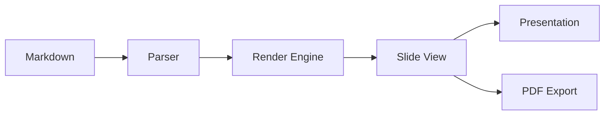

# Slides Plus

### A Slidev-inspired presentation plugin for Obsidian

<!-- Welcome to Slides Plus! This is a speaker note. It will appear in the presenter view but not in the presentation. -->

---

layout: center
---

## Features

- Markdown-based slide authoring
- Live preview panel
- Fullscreen presentation mode
- Speaker notes & presenter view
- Multiple layouts & themes
- Excalidraw, Mermaid & LaTeX support
- PDF export

---

layout: two-cols
---

## Two Column Layout

This content appears on the **left** side.

You can put any markdown here:

- Lists
- **Bold** and *italic*
- `inline code`

::right::

## Right Column

And this content appears on the **right** side.

> Use `::right::` to split content between columns.

---

## Mermaid Diagrams



<!-- Mermaid diagrams render natively through Obsidian's built-in support. -->

---

## LaTeX Math

Euler's identity:

$$e^{i\pi} + 1 = 0$$

The quadratic formula:

$$x = \frac{-b \pm \sqrt{b^2 - 4ac}}{2a}$$

Inline math works too: $\nabla \times \mathbf{E} = -\frac{\partial \mathbf{B}}{\partial t}$

---

layout: section
---

## Themes & Transitions

---

## Available Themes

Set the theme in your frontmatter:

```yaml
---
slides: true
theme: dark    # or: default, minimal
---
```

| Theme | Style |
|-------|-------|
| `default` | Inherits Obsidian's colors |
| `dark` | Deep blue with red accents |
| `minimal` | Clean, subtle, lots of whitespace |

---

## Slide Transitions

Set globally or per-slide:

```yaml
---
transition: fade   # slide, fade, slide-up, none
---
```

Each slide can override the global transition with its own `transition:` frontmatter.

<!-- You can mix transitions — for example, use fade for section dividers and slide for content. -->

---

layout: quote
---

> "The best way to predict the future is to invent it."
>
> — Alan Kay

---

layout: cover
background: sunset        # Use preset instead of CSS gradient
---

# Custom Backgrounds

Use preset names, colors, or image paths

Available presets: `sunset`, `ocean`, `forest`, `fire`, `night`, `aurora`

---

layout: center
text-size: large          # Simple preset instead of font-size CSS
---

## Markdown-Friendly Styling

No CSS knowledge required!

- Use `text-size: large` instead of `font-size: 1.2em`
- Use `background: ocean` instead of gradients
- Use `accent-color: purple` instead of hex codes

---

accent-color: orange      # Override accent color per slide
---

## Per-Slide Customization

```yaml
---
background: night
accent-color: teal
text-size: large
text-align: center
---
```

All values are **Markdown-friendly** — no CSS required!

---

## Excalidraw Integration

Embed Excalidraw drawings directly in your slides:

```
![[my-drawing.excalidraw]]
```

The drawing will render as SVG, scaling to fit the slide.

---

## Code Blocks

```typescript
interface Slide {
  index: number;
  content: string;
  notes: string;
  frontmatter: SlideFrontmatter;
}

function parseDeck(markdown: string): SlidesDeck {
  const { globalFrontmatter, body } = extractGlobalFrontmatter(markdown);
  const slides = splitSlides(body);
  return { globalConfig, slides };
}
```

---

## Keyboard Shortcuts

| Key | Action |
|-----|--------|
| `→` `↓` `Space` | Next slide |
| `←` `↑` | Previous slide |
| `Home` | First slide |
| `End` | Last slide |
| `Escape` | Exit presentation |
| `F` | Toggle fullscreen |

---

layout: center
---

## Commands

- **Start presentation** — present from current slide
- **Start with presenter view** — dual view with notes & timer
- **Open preview panel** — live sidebar preview
- **Open navigator** — thumbnail grid of all slides
- **Export to PDF** — print-ready slide export
- **Next/Previous slide** — navigate in editor
- **Insert slide** — add a `---` separator

---

layout: cover
---

# Thank You

Made with Slides Plus for Obsidian
