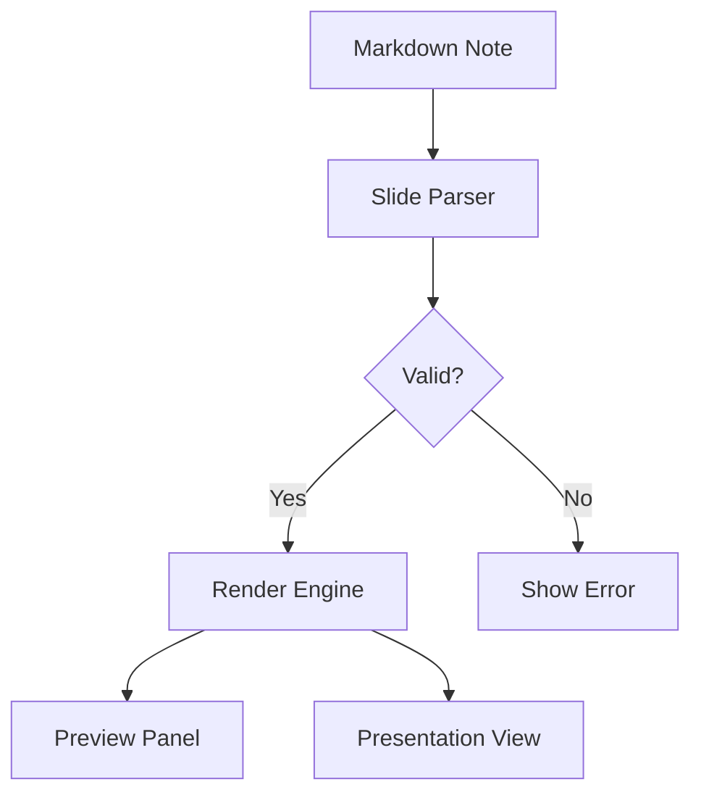

# Slides Plus

### Beautiful presentations from your Obsidian notes

<!-- Presenter notes: Welcome the audience and introduce yourself -->

---

## What is Slides Plus?

A presentation plugin for Obsidian that transforms your Markdown notes into beautiful slideshows.

- Write in Markdown
- Preview live
- Present directly from your vault

<!-- Presenter notes: Mention it works with existing notes, no export needed -->

---

## Features

- **6 Themes** — Obsidian, Midnight, Paper, Boardroom, Academic, Studio
- **8 Layouts** — Cover, center, two-cols, image-right, image-left, section, quote, full
- **Transitions** — Slide, fade, slide-up, or none
- **Presenter View** — Current slide, next preview, notes, and timer
- **PDF Export** — Self-contained HTML, print to PDF
- **Live Preview** — Sidebar updates as you type

<!-- Presenter notes: Each feature can be demonstrated live -->

---

## Themes

| Theme | Description |
|-------|-------------|
| `obsidian` | Adapts to Obsidian's light/dark mode |
| `midnight` | Deep blue, fixed dark palette |
| `paper` | Paper-and-ink, weight-based hierarchy |
| `boardroom` | Professional, projection-optimized |
| `academic` | Warm academic, Poppins + Lora fonts |
| `studio` | Bold artist's palette on black |

---

## Typography

# Heading One

## Heading Two

### Heading Three

Body text in Lora serif font. The academic theme combines **Poppins** for headings with **Lora** for body text, creating a distinctive and readable presentation style.

<!-- Presenter notes: Point out the font hierarchy and contrast -->

---

## Code Highlighting

```typescript {lines}
export function parseDeck(markdown: string): SlidesDeck {
  const normalized = markdown.replace(/\r\n/g, "\n");
  const { globalFrontmatter, body } = extractGlobalFrontmatter(normalized);
  const globalConfig = parseGlobalConfig(globalFrontmatter);
  
  return { globalConfig, slides: parseSlides(body) };
}
```

<!-- Presenter notes: Syntax highlighting supports many languages -->

---

## Code with Line Numbers

```python {1-4}
def fibonacci(n):
    if n <= 1:
        return n
    else:
        return fibonacci(n-1) + fibonacci(n-2)

result = fibonacci(10)
print(f"Fibonacci(10) = {result}")
```

<!-- Presenter notes: Line numbers help reference specific code sections -->

---

## Code Fragments

```typescript {all|1-2|3-4|5}
interface Slide {
  index: number;
  content: string;
  notes?: string;
  frontmatter: SlideFrontmatter;
}

// Fragments reveal code line by line
// Use {1-2} to group lines together
// Press arrow keys to navigate
```

<!-- Presenter notes: Arrow keys step through fragments -->

---

## Tables

| Theme | Background | Best For |
|-------|------------|----------|
| Academic | Warm cream | Academic talks |
| Midnight | Deep blue | Dark rooms |
| Paper | Off-white | Print handouts |
| Boardroom | White | Business presentations |
| Studio | Black | Creative work |

<!-- Presenter notes: Tables support alignment and formatting -->

---

## Table with Notes

| Feature | Status | Notes |
|---------|--------|-------|
| Themes | ✅ Complete | 6 built-in themes |
| Layouts | ✅ Complete | 8 layouts |
| Export | ✅ Complete | PDF via browser |
| Animations | 🔄 Planned | v0.2.0 |

*No hay examen sorpresa* — all features documented.

---

## Images with Captions


*Figure 1: Live preview panel showing slide content*

<!-- Presenter notes: Images scale to fit slide width -->

---

## Two-Column Layout

---
layout: two-cols
---

### Installation

1. Open Obsidian Settings
2. Browse Community Plugins
3. Search "Slides Plus"
4. Install and enable

::right::

### Requirements

- Obsidian v1.4.0+
- Desktop app (not mobile)
- Internet for fonts

<!-- Presenter notes: Custom column ratios supported -->

---

## Blockquote

> "The best presentations come from notes you already take."

— Anonymous

<!-- Presenter notes: Blockquotes use accent border styling -->

---

## LaTeX Math

Inline math: $E = mc^{2}$ and $\sum_{i=1}^{n} i = \frac{n(n+1)}{2}$

Block equations:

$$
f(x) = \int_{-\infty}^{\infty} \hat{f}(\xi)\,e^{2\pi i \xi x} \,d\xi
$$

$$
\frac{d}{dx}\left( \int_{a}^{x} f(t)\,dt \right) = f(x)
$$

---

## Mermaid Diagram



<!-- Presenter notes: Mermaid renders diagrams inline -->

---

## Theorem Callouts

> **Theorem (Pythagorean).** In a right triangle, the square of the hypotenuse equals the sum of squares of the other two sides.
> 
> $$a^{2} + b^{2} = c^{2}$$

> *Proof.* The proof follows from the similarity of triangles. ∎

---

## Nested Lists

1. **Install the plugin**
   - Via Obsidian Settings
   - Or download from GitHub releases
   
2. **Create a presentation**
   - Add `slides: true` to frontmatter
   - Separate slides with `---`
   
3. **Present**
   - Open preview panel
   - Click "Present" button

<!-- Presenter notes: Lists support deep nesting -->

---

## Content Cards

**Markdown-based**

Write presentations in plain Markdown. No new syntax to learn.

**Live Preview**

See changes instantly in the sidebar as you edit.

**Custom Themes**

Six built-in themes with customizable colors and fonts.

---

## Footnotes

Slides Plus supports Markdown footnotes.[^1] They appear as superscripts[^2] and are collected at the bottom of each slide.

[^1]: Footnotes are great for citations and additional context.
[^2]: Click the superscript to jump to the footnote.

---

## Background Presets

Use gradient backgrounds via frontmatter:

```yaml
background: sunset    # warm orange gradient
background: ocean     # blue teal gradient  
background: forest    # green gradient
background: fire      # red orange gradient
background: night    # dark purple gradient
background: aurora    # green purple gradient
background: cosmic   # purple blue gradient
```

<!-- Presenter notes: Backgrounds can be set per-slide -->

---

## Thank You

### Get Started

1. Install from Obsidian Community Plugins
2. Create a note with `slides: true`
3. Press `Ctrl+Shift+P` and search "Slides Plus"

**GitHub:** github.com/aqcohen/obsidian-slides-plus

<!-- Questions? -->
