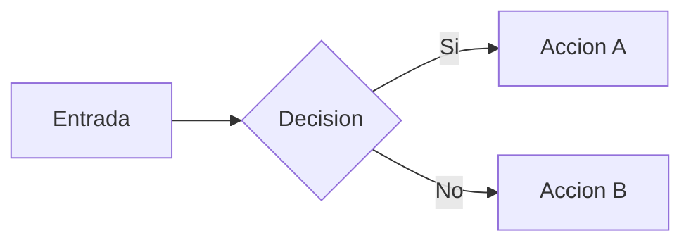
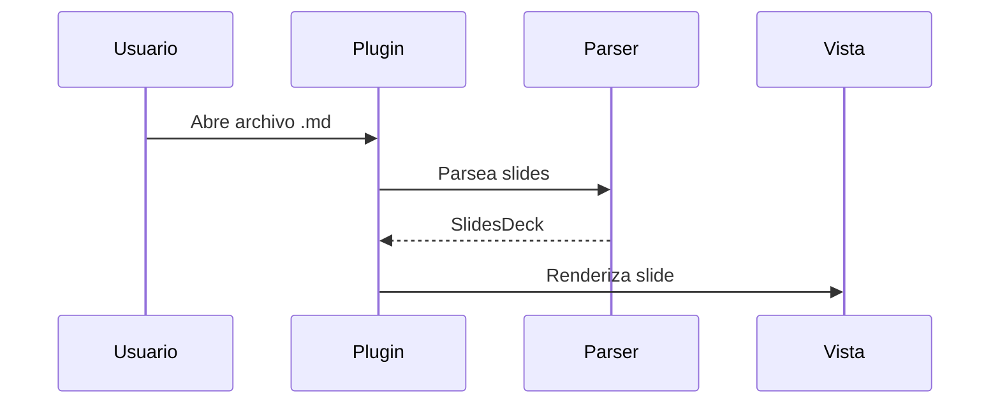

# Slides Plus

### Guia interactiva de funcionalidades

Usa las flechas para navegar entre slides

<!-- Esta es una nota del presentador. Solo se ve en el modo presenter, nunca en la presentacion. -->

---
layout: center
---

## Frontmatter Global

El primer bloque YAML configura todo el deck:

```yaml
---
slides: true          # Obligatorio para activar el plugin
theme: default        # Tema visual: default | dark | minimal
transition: slide     # Transicion: slide | fade | slide-up | none
aspectRatio: 16/9     # Relacion de aspecto: 16/9 | 4/3 | 16/10
---
```

`slides: true` es lo unico requerido. El resto es opcional.

---

## Separador de Slides

Cada slide se separa con tres guiones en su propia linea:

```markdown
# Slide 1

Contenido del primer slide

---

# Slide 2

Contenido del segundo slide
```

En el editor veras una linea decorativa con el numero de slide en lugar del `---`.

---

## Notas del Presentador

Escribe notas dentro de comentarios HTML:

```markdown
## Mi Slide

Contenido visible en la presentacion.

<!-- Esto solo se ve en el presenter view.
     Puedes escribir varias lineas. -->
```

Las notas aparecen en el **Presenter View** junto con un timer y el slide siguiente.

<!-- Ejemplo: esta nota solo aparece en el presenter view. Puedes usarla para recordar puntos clave. -->

---
layout: cover
---

# Layout: Cover

Texto centrado y grande, ideal para portadas.

Se activa con `layout: cover` en el frontmatter del slide.

---

## Layout: Default

Este es el layout por defecto. El contenido fluye de arriba hacia abajo.

No necesitas especificar nada — se usa automaticamente cuando no pones `layout:` en el frontmatter del slide.

```yaml
---
layout: default    # Opcional, es el valor por defecto
---
```

- Los bullets funcionan normalmente
- Las imagenes se ajustan al ancho
- El texto sigue el flujo natural del documento

---
layout: center
---

## Layout: Center

Todo el contenido esta centrado vertical y horizontalmente.

```yaml
---
layout: center
---
```

Ideal para frases destacadas o slides con poco contenido.

---
layout: two-cols
---

## Layout: Two-Cols

Este contenido esta en la **columna izquierda**.

Usa `::right::` para separar el contenido entre columnas.

```yaml
---
layout: two-cols
---
```

::right::

## Columna Derecha

Este contenido esta en la **columna derecha**.

```markdown
Texto izquierdo...

::right::

Texto derecho...
```

Ambas columnas tienen el mismo ancho.

---
layout: section
---

## Layout: Section

---

## Asi se usa Layout: Section

Un heading grande y centrado. Perfecto como divisor entre secciones de la presentacion.

```yaml
---
layout: section
---

## Nombre de la Seccion
```

El texto se muestra extra grande y centrado.

---
layout: quote
---

> "La simplicidad es la maxima sofisticacion."
>
> — Leonardo da Vinci

---

## Asi se usa Layout: Quote

Estiliza las citas con padding extra y borde lateral destacado.

```yaml
---
layout: quote
---

> "Tu cita aqui."
>
> — Autor
```

Solo agrega `layout: quote` y escribe un blockquote normal con `>`.

---
layout: image-right
image: https://picsum.photos/600/400
---

## Layout: Image-Right

El contenido va a la izquierda y la imagen a la derecha.

```yaml
---
layout: image-right
image: https://url-de-tu-imagen.jpg
---
```

Usa `image:` en el frontmatter para indicar la URL o ruta de la imagen.

Tambien existe `image-left` que invierte las posiciones.

---
layout: full
---

## Layout: Full

Este layout elimina todo el padding. El contenido ocupa el slide completo sin margenes.

```yaml
---
layout: full
---
```

Util para imagenes a pantalla completa o contenido que necesita todo el espacio disponible.

---

## Fondos Personalizados

Cada slide puede tener su propio fondo:

```yaml
# Color solido
---
background: #2d3436
---

# Gradiente
---
background: linear-gradient(135deg, #667eea, #764ba2)
---

# Imagen
---
background: https://ejemplo.com/foto.jpg
---
```

El plugin detecta automaticamente si es un color, gradiente o URL de imagen.

---
background: linear-gradient(135deg, #0f0c29, #302b63, #24243e)
---

## Ejemplo de Fondo Gradiente

Este slide usa:

```yaml
---
background: linear-gradient(135deg, #0f0c29, #302b63, #24243e)
---
```

El texto se muestra sobre el gradiente.

---

## LaTeX — Matematicas

Usa la sintaxis estandar de Obsidian para formulas:

**Inline:** Escribe entre signos de dolar: `$E = mc^2$` se ve como $E = mc^2$

**Bloque:** Usa doble signo de dolar:

```latex
$$\int_0^\infty e^{-x}\,dx = 1$$
```

$$\int_0^\infty e^{-x}\,dx = 1$$

$$x = \frac{-b \pm \sqrt{b^2 - 4ac}}{2a}$$

---

## Mermaid — Diagramas

Usa bloques de codigo con el lenguaje `mermaid`:

````markdown

````


---

## Mermaid — Mas Tipos de Diagramas



Soporta todos los tipos de Mermaid: flowchart, sequence, gantt, pie, class, state, etc.

---

## Excalidraw — Dibujos

Embebe dibujos de Excalidraw usando la sintaxis de embed de Obsidian:

```markdown
![[mi-dibujo.excalidraw]]
```

**Requisitos:**
- Tener el plugin Excalidraw instalado (para renderizado completo)
- Sin el plugin, Slides Plus intenta extraer el SVG del archivo `.excalidraw.md`

El dibujo se escala automaticamente al tamano del slide.

---

## Bloques de Codigo

Los bloques de codigo se renderizan con syntax highlighting:

```typescript
interface Slide {
  index: number;
  content: string;
  notes: string;
  frontmatter: SlideFrontmatter;
}

const deck = parseDeck(markdown);
console.log(`Total slides: ${deck.slides.length}`);
```

Soporta todos los lenguajes que soporta Obsidian.

---
layout: two-cols
---

## Tablas

Las tablas de markdown funcionan normalmente:

| Propiedad | Tipo | Default |
|-----------|------|---------|
| theme | string | default |
| transition | string | slide |
| aspectRatio | string | 16/9 |
| layout | string | default |

::right::

## Listas

**Ordenadas:**
1. Primer elemento
2. Segundo elemento
3. Tercer elemento

**Desordenadas:**
- Item con **negritas**
- Item con *italicas*
- Item con `codigo inline`

---
transition: fade
---

## Transiciones por Slide

Este slide usa `transition: fade` en vez del `slide` global.

```yaml
---
transition: fade
---
```

| Transicion | Efecto |
|------------|--------|
| `slide` | Desliza horizontalmente (default) |
| `fade` | Aparece/desaparece gradualmente |
| `slide-up` | Desliza verticalmente |
| `none` | Cambio instantaneo |

Cada slide puede sobreescribir la transicion global.

---

## Temas Disponibles

Cambia el tema en el frontmatter global:

```yaml
---
slides: true
theme: dark       # o: default, minimal
---
```

| Tema | Descripcion |
|------|-------------|
| `default` | Hereda los colores de tu tema de Obsidian |
| `dark` | Fondo azul oscuro con acentos rojos |
| `minimal` | Limpio, sutil, mucho espacio en blanco |

El tema se aplica a todos los slides del deck.

---

## Clase CSS Personalizada

Agrega clases CSS propias a cualquier slide:

```yaml
---
class: mi-clase-custom
---
```

Luego define `.mi-clase-custom` en un CSS snippet de Obsidian:

```css
.mi-clase-custom {
  font-family: "Georgia", serif;
  background: #fdf6e3;
}
```

Settings → Appearance → CSS snippets

---
layout: two-cols
---

## Panel de Preview

Abre el panel lateral con:

**Comando:** `Slides Plus: Open slide preview panel`

Funcionalidades:
- Muestra el slide donde esta tu cursor
- Se actualiza en tiempo real al escribir
- Botones de navegacion (anterior/siguiente)
- Boton "Present" para iniciar

::right::

## Slide Navigator

Abre la grilla de thumbnails con:

**Comando:** `Slides Plus: Open slide navigator`

Funcionalidades:
- Miniaturas de todos los slides
- Click para saltar a un slide en el editor
- Muestra numeros de slide
- Indica que slides tienen notas
- Se actualiza al editar

---

## Modo Presentacion

**Iniciar:** `Slides Plus: Start presentation`

Comienza desde el slide donde esta tu cursor.

| Tecla | Accion |
|-------|--------|
| `→` `↓` `Espacio` `PageDown` | Siguiente slide |
| `←` `↑` `PageUp` | Slide anterior |
| `Home` | Primer slide |
| `End` | Ultimo slide |
| `F` | Pantalla completa |
| `Escape` | Salir |

Tambien puedes hacer **click**: tercio izquierdo retrocede, dos tercios derechos avanza.

---

## Presenter View

**Iniciar:** `Slides Plus: Start presentation with presenter view`

Abre dos vistas sincronizadas:

1. **Slide actual** — vista grande a la izquierda
2. **Siguiente slide** — preview pequeno arriba a la derecha
3. **Timer** — tiempo transcurrido con boton de reset
4. **Notas** — tus comentarios `<!-- -->` del slide actual

Navegar en la presentacion actualiza el presenter automaticamente.

---

## Exportar a PDF

**Comando:** `Slides Plus: Export slides to PDF`

Pasos:
1. Ejecuta el comando
2. Se abre el dialogo de impresion del navegador
3. Configura:
   - **Orientacion:** Horizontal
   - **Margenes:** Ninguno
   - **Graficos de fondo:** Activado
4. Guarda como PDF

Cada slide se convierte en una pagina.

---

## Navegar en el Editor

Dos comandos para moverte entre slides sin salir del editor:

- `Slides Plus: Go to next slide` — salta al siguiente `---`
- `Slides Plus: Go to previous slide` — salta al anterior `---`

Y para agregar slides nuevos:

- `Slides Plus: Insert new slide separator` — inserta `---` en la posicion del cursor

Puedes asignar atajos de teclado a estos comandos en Settings → Hotkeys.

---

## Configuracion

Settings → Slides Plus:

| Opcion | Descripcion | Default |
|--------|-------------|---------|
| Default theme | Tema cuando no se especifica | `default` |
| Default transition | Transicion por defecto | `slide` |
| Aspect ratio | Proporcion de slides | `16:9` |
| Base font size | Tamano de fuente (16-40px) | `24px` |
| Show slide numbers | Mostrar contador | Activado |
| Auto-open preview | Abrir preview al abrir archivo slides | Activado |

---

## Todos los Comandos

| Comando | Descripcion |
|---------|-------------|
| Start presentation | Presentar desde el slide actual |
| Start with presenter view | Presentar con vista de notas |
| Open slide preview panel | Panel lateral con preview |
| Open slide navigator | Grilla de thumbnails |
| Export slides to PDF | Generar PDF |
| Go to next slide | Navegar al siguiente en editor |
| Go to previous slide | Navegar al anterior en editor |
| Insert new slide separator | Insertar `---` |

Todos accesibles con `Ctrl/Cmd + P` → "Slides Plus"

---

## Frontmatter por Slide — Resumen

```yaml
---
layout: cover          # Tipo de layout
transition: fade       # Transicion para este slide
background: #1a1a2e   # Color, gradiente o imagen
image: ./foto.jpg      # Imagen para layouts image-right/left
class: mi-clase        # Clase CSS personalizada
---
```

Todas las propiedades son opcionales. Solo agrega las que necesites.

---
layout: cover
background: linear-gradient(135deg, #667eea 0%, #764ba2 100%)
---

# Fin

Hecho con **Slides Plus** para Obsidian

`Ctrl/Cmd + P` → Slides Plus: Start presentation
