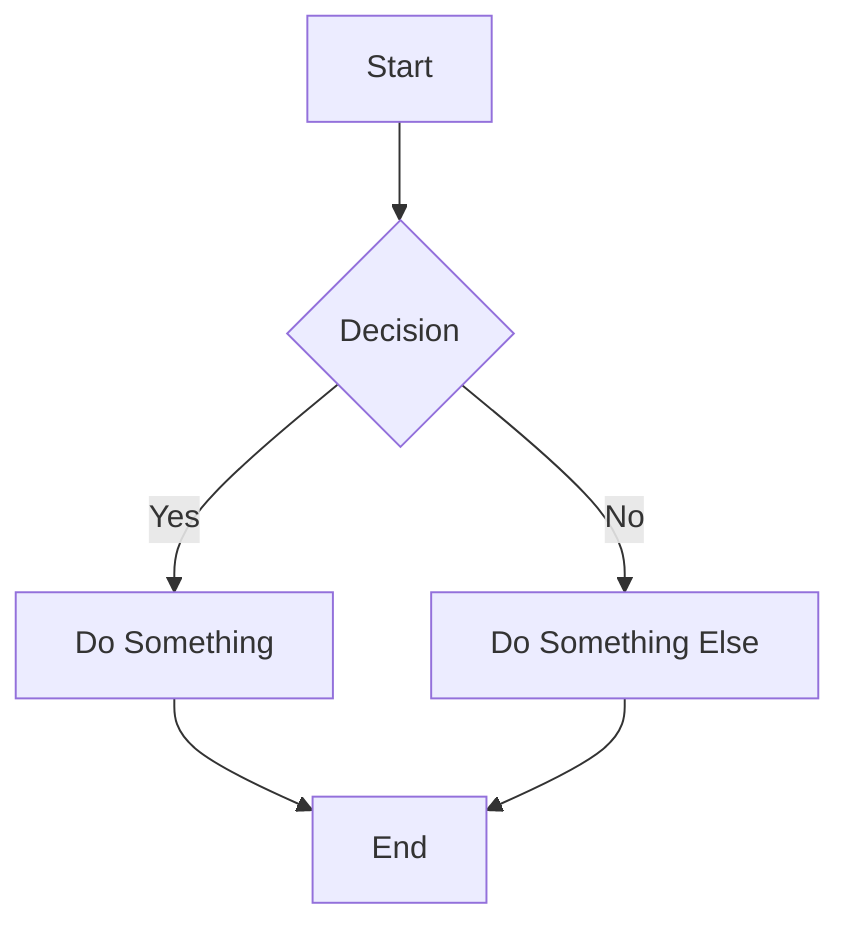
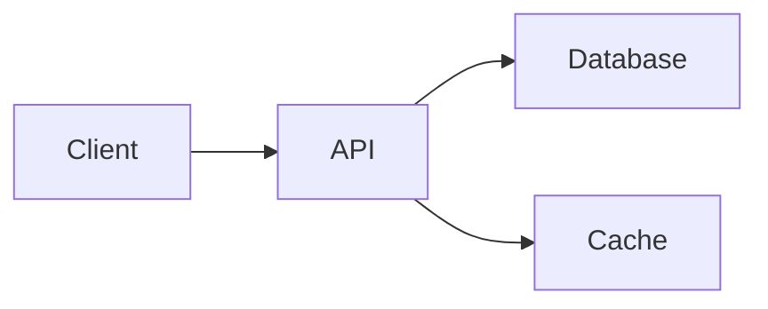
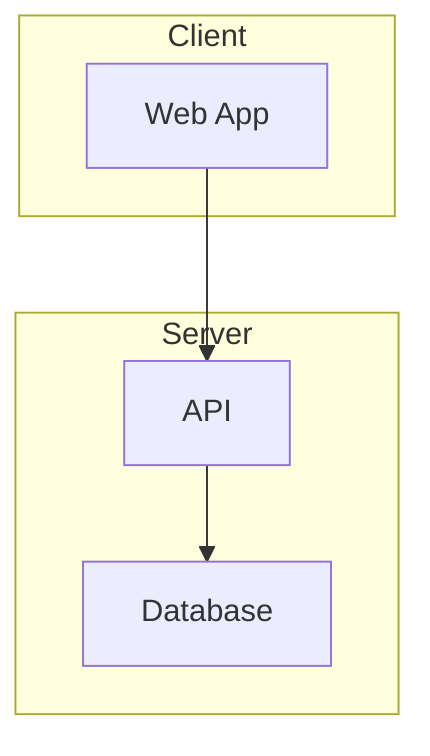

# Integrations

Slides Plus supports Excalidraw, Mermaid, and LaTeX out of the box.

## Excalidraw

Embed Excalidraw drawings in your presentations.

### Installation

1. Install the [Excalidraw plugin](https://github.com/zsviczian/obsidian-excalidraw-plugin)
2. Create drawings in Obsidian
3. Embed them in slides

### Usage

```markdown
---

## Diagram

![[my-drawing.excalidraw]]
```

### Supported Formats

- `.excalidraw` - Excalidraw raw format
- `.excalidraw.md` - Excalidraw with markdown wrapper

### Requirements

- [Excalidraw plugin](https://github.com/zsviczian/obsidian-excalidraw-plugin) must be installed
- Drawing file must be in your vault

### Fallback

If Excalidraw plugin is not available, a placeholder will show with the filename.

## Mermaid

Create diagrams using Mermaid syntax.

### Usage

````markdown

````

### Supported Diagrams

- Flowcharts
- Sequence diagrams
- Class diagrams
- State diagrams
- Entity relationship diagrams
- Gantt charts
- Pie charts

### Example

````markdown
---
layout: two-cols
---

## Architecture


::right::

## Flow

1. Client requests
2. API processes
3. Data fetched
````

## LaTeX / Math

Render mathematical equations with LaTeX.

### Inline Math

```markdown
The formula $E = mc^2$ is famous.
```

### Block Math

```markdown
$$
\int_{-\infty}^{\infty} e^{-x^2} dx = \sqrt{\pi}
$$
```

### Examples

#### Inline

```markdown
The quadratic formula is $x = \frac{-b \pm \sqrt{b^2-4ac}}{2a}$
```

#### Display

```markdown
$$
\sum_{i=1}^{n} i = \frac{n(n+1)}{2}
$$

$$
\vec{F} = m\vec{a}
$$

$$
\LaTeX
$$
```

### MathJax Support

Slides Plus uses MathJax for rendering, which supports:
- Standard LaTeX math
- AMSmath commands
- Chemical equations (mhchem)

```markdown
$$
\ce{H2O ->[heat] H2 + O}
$$
```

## Combined Example

You can combine all integrations in one slide:

````markdown
---
layout: two-cols
---

## System Design



::right::

## Math Model

The system follows:

$$f(x) = \int_{0}^{\infty} e^{-x^2} dx$$

Where:

- $x$ = input value
- $f(x)$ = output

## Diagram

![[architecture.excalidraw]]
````

## Troubleshooting

### Excalidraw not showing

1. Verify Excalidraw plugin is installed and enabled
2. Check the file exists in your vault
3. Ensure file has `.excalidraw` extension

### Mermaid not rendering

Mermaid should work automatically. If not:
1. Restart Obsidian
2. Check for conflicts with other plugins

### LaTeX not rendering

1. Ensure MathJax loads (check network tab)
2. Use correct LaTeX syntax
3. Check for JavaScript errors in console
